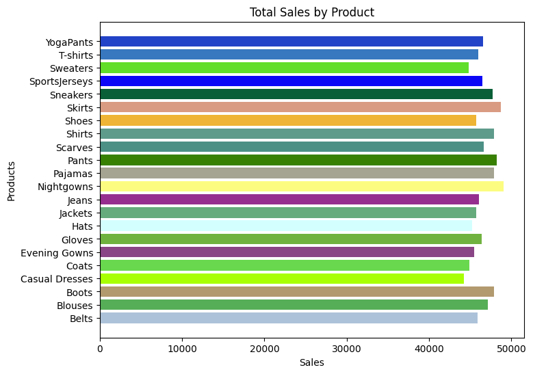
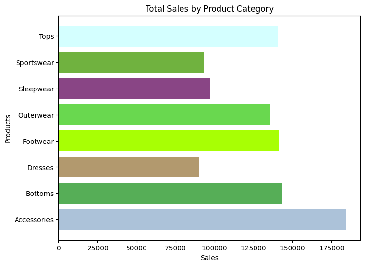

# Data Analyst

#### Technical Skills: Python, SQL, AWS, Snowflake, MATLAB

## Education			       		
- M.Sc., Computing	| Sheffiled Hallam University (_October 2020_)	 			        		
- B.A., Marketing | Manchester Metropolitan University (_July 2015_)

## Work Experience
**Data Analyst @ Engie (_August 2022 - Present_)**
- Redeveloped REGO sales model which resulted in 35% improvement in model performance and saving 1 million dollars in potential losses
- Designed, developed and launched a churn prediction system that detects early warning signs of customer churn which impacted 89% of active accounts
  

**Data Analyst @ Global Data (_January 2021 - August 2022_)**
- Conducted researcher interviews, data collection, processing, and analysis for Latin American beverage data. Data is fed through to in-house database and used to build market sizing and competitor reports – content is distributed to subscribers through the Global Data Intelligence Center.
- Analysed historical pricing data and leveraged customer feedback to fine-tune pricing structures

## Projects

### [1. Store Sales Analysis](https://github.com/MrKome/Store_Sales_Analysis)

### Overview 

This project walks through the process of conducting in-depth sales analysis on a dataset using NumPy. It covers the intricacies of data handling, including uploading and storing a Sales dataset, and delving into data cleaning and normalisation techniques. 

This project covers concepts like statistical analysis, exploring concepts like mean, median, and standard deviation.

#### Scatter plot showing the relationship between Advertisment Expenses and Sales for January 2023

### Walkthrough: 

- Upload the csv file into google colab virtual memory
- Read file using NumPy and store it into an array 
- Perform data cleaning
- Perform data normalisation
- Perfom statistical analysis
- Perform sales analysis such as: best selling product, or product category
- Display data and analysis on charts using matplotlib 

### Data Source

The csv file used 'Sales_Numpy.csv' has been added to the repository. 

### Tools 

- Python

### Results/Findings

- Best selling product in January 2023 is Nightgowns
- Best selling category in January 2023 is Accessories
- The overall Average sales: 1502.42
- Average Sales based on product (Nightgowns): 1583.3870967741937

#### Total sales by Product for January 2023

#### Total sales by Product Category for January 2023

---

## [2. Displaying Live System Performance using Power BI, SQL and Python ](https://github.com/MrKome/System_info_performance_Monitor)

### Overview 

This project Shows the subsequent steps following the development of a new database in Microsoft SQL Server Importing Python system. It covers using Python to get system performance informationand, Testing Application, Connertiing Power BI to SQL Server, Creating Power BI Dashboard and Testing the final results.

### Live Power BI Dashboard

### Data Source

Python script is used to read system performance information such as: 
- cpu_usage
- memory_usgae
- cpu_interrupts
- cpu_calls
- memory_used
- memory_free
- bytes_sent
- bytes_received
- disk_usage

### Tools 

- Python, Microsoft SQL Server, Power BI

---

## [3. Telco Customer Churn Prediction](https://github.com/MrKome/DS_Churn_Project/tree/main)

### Overview 

This project aims to predict Telco customer churn and provide insight into the performance of a company. By analysing various aspects of the data, we seek to identify trends and gain an understanding of the company's performance. 

#### Distribution of data and the value count for Gender

### Data Source

Customer Churn Data: The primary dataset used for this analysis is the "WA_Fn-UseC_-Telco-Customer-Churn" file, containing detailed information about each customer. 

### Tools 

- Python 

### Exploratory Data Analysis

EDA involved exploring the customer churn data to answer key questions, such as: 

- How many people are churning vs how many people are returning?
- What is the percentage of customers that are leaving?
- Can we visualise the churn count for both male and females to see a correlation?
- Can we visualise the churn count for the internet service to see a correlation?

#### Distribution of data and the value count for the Internet Service

### Data Cleaning

In the intial data preparation phase, we performed the following tasks:

- Data Loading and inspection
- Handling misssing Values
- Data Cleaning and formatting

### Prediction, Training and Testing

- Split the data into training and testing
- Create and train the model 
- Create the predictions on the test data

### Results/Findings

The prediction results are summarised as follows:
- We can see our model has a 91% recall,
- We can see our model has a 85% precsion
- We can see our model has a 88% f1-score
- We can see our model has an accuracy of 81% 
